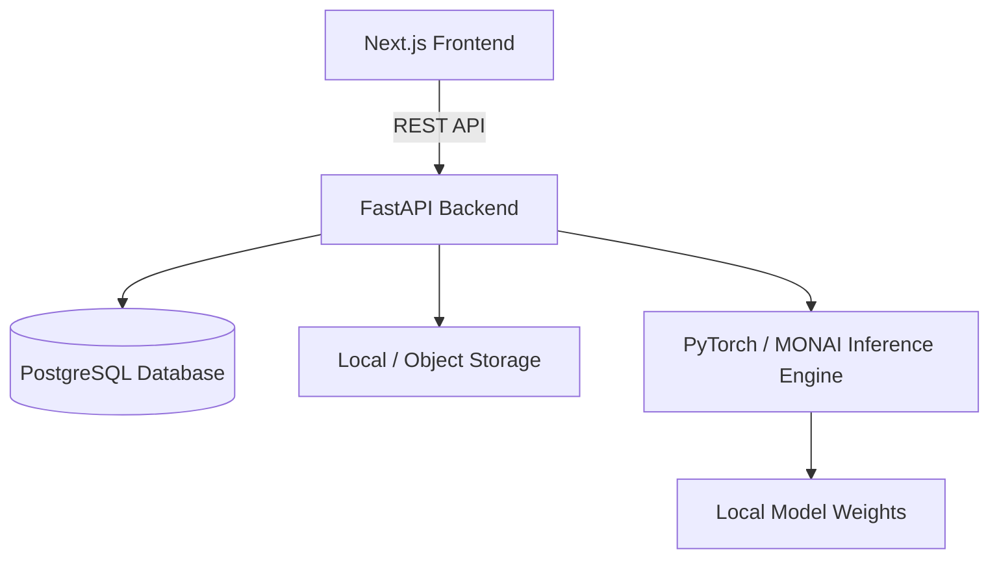
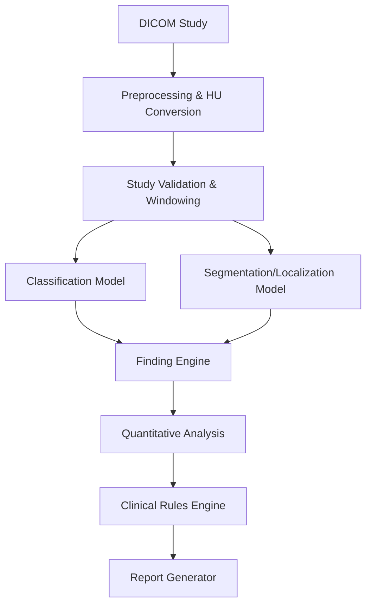

# ARCHITECTURE

## System Architecture

RADIS follows a modern decoupled architecture:

## AI Architecture

The AI module is not a single black box. It is a pipeline of sequential and parallel processors:

## Backend Flow

1. **Upload**: User uploads DICOM ZIP.
2. **Parsing**: `pydicom` parses the headers, validates it's a Non-Contrast Brain CT.
3. **Queue/Inference**: The CT volume is passed to the AI Engine.
4. **Processing**: Results (JSON) are stored in the Database.
5. **Report**: Rules engine determines priority; structured report is drafted.
6. **Serve**: Frontend fetches the study, images, and report.

## Inference Flow
- **Data format**: 3D NIfTI or stacked 2D NumPy arrays.
- **Model**: PyTorch model outputs probabilities.
- **Thresholding**: Configurable confidence thresholds determine if a finding is presented to the user.
