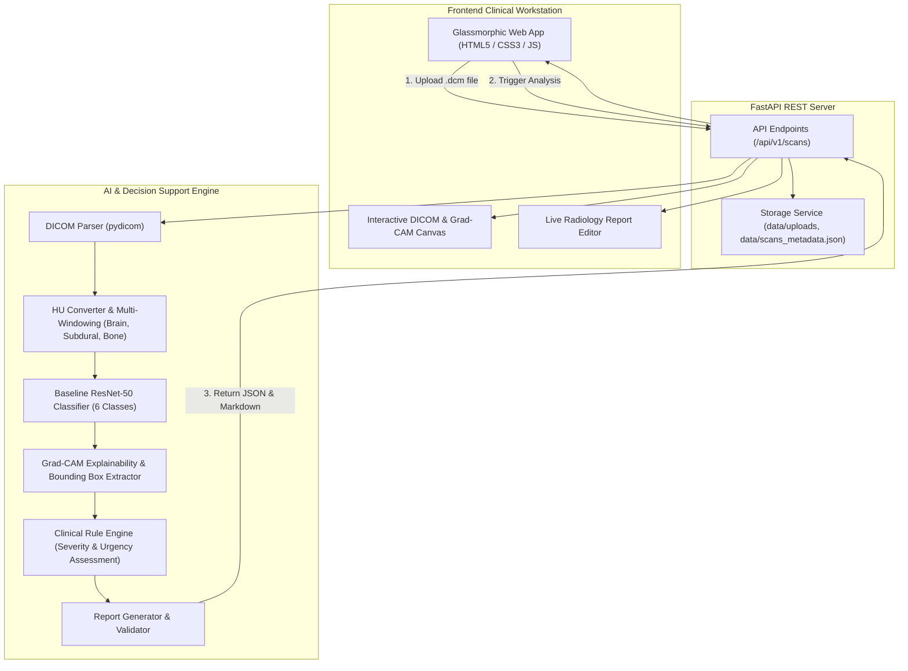

# RADIS — System Architecture & Pitch Document

## 1. Problem Statement & Clinical Need
Intracranial Hemorrhage (ICH) is a critical neurological emergency requiring rapid diagnosis and immediate intervention. In emergency departments, time-to-treatment directly impacts patient survival and long-term disability. However, radiologists face mounting scan volumes, causing diagnostic delay and fatigue.

**RADIS (Radiology AI Decision Support & Reporting)** addresses this challenge by providing an automated AI triage system that parses DICOM CT scans, predicts multi-label hemorrhage risks, localizes lesions with Grad-CAM heatmaps and bounding boxes, applies deterministic clinical rule engines to calculate urgency/severity, and drafts standardized radiology reports.

---

## 2. System Architecture

---

## 3. End-to-End Workflow

1. **DICOM Ingestion**: Reads raw DICOM `.dcm` files, extracts rescale slope/intercept, and converts raw pixel arrays to Hounsfield Units (HU).
2. **Multi-Windowing**: Generates a 3-channel image using clinical CT windows:
   - **Brain Window**: Level 40, Width 80
   - **Subdural Window**: Level 80, Width 200
   - **Bone Window**: Level 600, Width 2000
3. **Multi-Label Neural Classification**: ResNet-50 backbone outputs predicted probabilities for 6 target classes: `any`, `epidural`, `intraparenchymal`, `intraventricular`, `subarachnoid`, and `subdural`.
4. **Explainability & Localization**: Computes Grad-CAM gradients on `layer4` to generate heatmaps and extracts bounding box coordinates `(x, y, w, h)`.
5. **Clinical Decision Support**:
   - **Urgency**: `HIGH` if epidural, subdural, or subarachnoid hemorrhage detected.
   - **Severity**: Escalated to `HIGH` if probability >= 0.9 or bounding box area > 10% of scan.
6. **Structured Report Generation**: Synthesizes formal medical text for Technique, Findings, and Impression sections.

---

## 4. Key Performance & Resilience Metrics
- **Automated Test Coverage**: 25/25 unit, API, and integration tests passing.
- **Inference Speed**: ~0.15s per scan on CPU (~150ms total execution latency).
- **Failure Resilience**: Graceful HTTP 500 error handling for corrupted DICOM byte streams; zero-array normalization safety.

---

## 5. Limitations & Future Scope
- **Current MVP Scope**: 2D axial slice processing with ResNet-50 baseline.
- **Future Scope**:
  - 3D Volumetric U-Net segmentation integration.
  - PACS / DICOMweb (WADO-RS / QIDO-RS) enterprise integration.
  - LLM fine-tuning for conversational clinical Q&A on findings.
